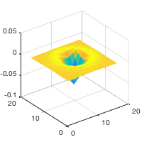
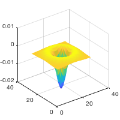
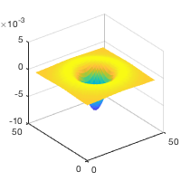
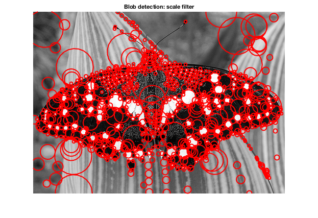
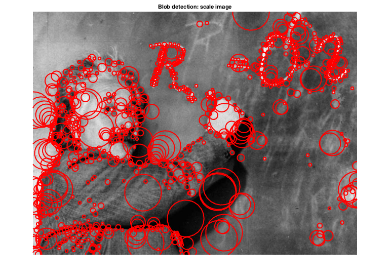
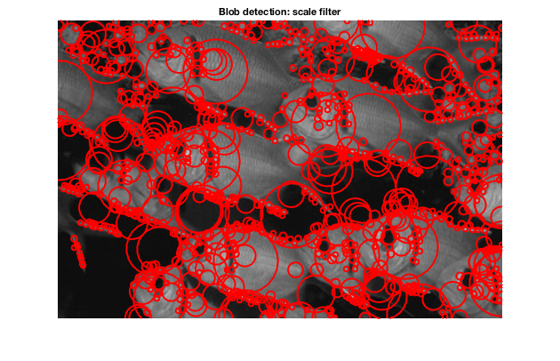
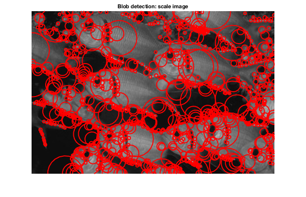
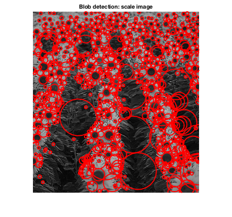
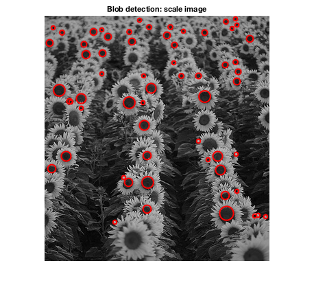
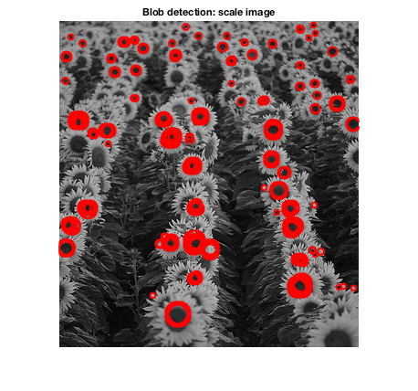

# Computer-Vision-ScaleSpace-Blob-Detection

Umich EECS 442 (Winter 2018) homework 3 by Wenzhe Xu

Keywords: feature (blob) extraction using LoG filter

## Introduction
Blobs are important features in images. In this homework, circular blobs are detected by applying a Laplacian of Gaussian filter at a variety of scales. Two separate functions `detectBlobsScaleFilter()` and `detectBlobsScaleImage()` are to be implemented. The first implementation is increasing the size of the filter to detect blobs at different sizes and the second implementation is scaling the image instead before applying the filter. Both implementations are followed by a nonmaximum suppression procedure in scale space. The detection results are plotted on grayscale images for better visibility


## Method
Since a blob is extracted by its edges, let us first review the edge detection. A edge is detected by passing the image to a Gaussian low pass filter and taking 1 derivatives or 2 derivatives. Similarly, the magnitude of the Laplacian response will achieve a maximum at the center of the blob, provided the scale of the Laplacian is "matched" to the scale of the blob.

Algorithm

1. convolve the image with a "blob filter" at multiple scales
2. look for extrema of filter response in the resulting scale space. 

In step 1, a 3D scale space (h,w,n) is established. There are n levels representing n different scales. These scales form a geometric series with ratio k. For each level, the squared filter response is stored. 

#### `detectBlobsScaleFilter()`
This method scales the Laplacian filter and keeps the image same. For later comparison across levels, a normalized Laplacian filter $$\sigma_i^2\nabla^2$$ is convolved with the image at level $$i$$. This filter is created using `L = sigma(i)^2*fspecial('log',hsize,sigma(i))`. Note that the hsize is at least $$\pm 3\sigma$$ wide. The window width has to be odd since symmetric box around the pixel has more accurate information at the box center. Filters at level 2,5,8 (from left to right) are shown below. Filter at higher level has a larger domain to compute response. Hence `detectBlobsScaleFilter()` is slower than `detectBlobsScaleImage()`. The squared response is stored since both local maxima and local minima need to be extracted.



#### `detectBlobsScaleImage()` 
It is relatively inefficient to repeatedly filter the image with a kernel of increasing size. Instead of increasing the kernel size by a factor of k, the image is downsampled by a factor 1/k. The response of this downsampled image to the same filter needs to be upsampled via interpolation. **Note that for this method, there is no normalization for filters across levels** since the response of the filter is scale-invariant. Unlike the scaleFilter method, the response across different scales does not decay since the literal $$\sigma$$ is unchanged and only the effect $$\sigma$$ gets scaled.

#### `nonmaximumSuppression()`
This non-maximum suppression procedure is called by the two methods above to find the extrema. Non-maximum suppression in each 2D slice is performed first seperately (across space). For each pixel, the maximum value among all its 8 neighbours and itself is taken as its "nmaxsup" value. Different methods like `nlfilter()`, `colfilt()`, and `ordfilt2()` are compared and the `ordfilt2()` method is found to be the fastest and it is adopted in this homework. 

Next, non-maximum suppression is performed for different levels (across scales). A findmax scan procedure is conducted from lower level to higher level. Extremas are found by comparing this "nmaxsup" 3D space with "scaleSpace" 3D space. This procedure finds the proper scale in scale space at potential extrema pixels.

Finally, blobs are returned by comparing non-zero squared reponses to the threshold in 3D space. The radius of circular blob is $$\sqrt{2}\sigma$$. The squared response is used as the score of the blob. The highest scoring 1000 detected blobs for each image are displayed.

## Result
#### Parameters
```
parameters     |     sigma1   k     n     threshold
---------------------------------------------------
butterfly.jpg  |       2     1.2    15      0.015
einstein.jpg   |       2     1.2    15      0.005
fishes.jpg     |       2     1.2    15      0.004
sunflowers.jpg |       2     1.2    15      0.012
```
#### Running time
```
running time   |    scale filter     scale image
------------------------------------------------
butterfly.jpg  |    0.836064         0.258333
einstein.jpg   |    1.435847         0.446825
fishes.jpg     |    0.804886         0.250044
sunflowers.jpg |    0.625142         0.179539
```
#### Relation between the size of filter, sigma, and blob radius
As mentioned in the **Method** section, the filter window is $$\pm 3\sigma$$ (rounded odd). The blob radius is $$\sqrt{2}\sigma$$.
#### Storage plan
As mentioned above, the squared Laplacian response is stored in a 3D matrix (h,w,n), named "scaleSpace". For scaleImage method, the "scaleSpace" stores the interpolated (upsampled) response with size = (h,w) at each level. This plan has same dimensions for each level. Hence, it is easy to perform non-maximum suppression in matrix way. The non-maximum suppression matrix is in 3D (h,w,n), named "nmaxsup".
#### Circle detector outputs 
  
  
  
  
  
  
   


## Analysis
#### Comparison `nlfilter`, `colfilt` and `ordfilt2`
In the non-maximum suppression of each 2D slice, the maximum value around the 3-by-3 kernel needs to be calculated. One experiment of the running time with these methods for `detectBlobsScaleFilter` on `sunflowers.jpg` are listed below. Multiple experiments show that `ordfilt2` is the fastest method. Hence it is adopted in this homework.

```
              running time
nlfilter        9.892374
colfilt         0.267509
ordfilt2        0.189329
```

#### Comparison of `resize` options for interpolation
Six interpolation options are compared: bicubic, bilinear, box, lanczos2, lanczos3, nearest. The running time for these options are in the same order. Their detection results (Threshold = 0.05) are shown below.

bicubic  
  

bilinear  
  

box  
 
 
lanczos2  
  

lanczos3  
  

nearest  
  

The nearest option and the box option gives many concentric circles, which is bad for detection. Option lanczos2 and lanczos2 have the similar results. Option bilinear lost some important blobs. Hence **bicubic** is used in this homework.

#### Speed improvement
The scaleFilter method calculates the squared Laplacian response for each level. Higher level has larger scale $$\sigma$$. Due to the relation between $$\sigma$$ and the Laplacian filter window width (about 6 $$sigma$$ for better filter quantization), the filter domain is larger for large $$\sigma$$. Since the scale grows exponentially from lower level to higher level, the computational cost is extremely high. 

The scaleImage method improves the speed by first downsampling the image, then calculating the response, finally upsampling (interpolating) the response. The size of the filter domain is unchanged from level to level. Furthermore, the image domain for calculation gets shrinked. Hence, the computational cost decays from lower level to higher level.

Based on the experient, compared to the scaleFilter method, the scaleImage method saves about 70% for the runs with parameters mentioned above, and will save more time if $$\sigma_n$$ (largest scale) is larger. The scaleImage method might introduce error during downsampling and upsampling. However, the acceptable result with huge cost reduction favors the scaleImage method.